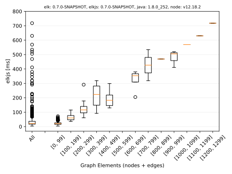

# Execution Time Comparison ELK (Java) vs elkjs

Results shown below are for the Ptolemy models in the [elk-models](https://github.com/eclipse/elk-models) repository. 

Each algorithm was run ten times for each diagram, with the shortest execution time being recorded. An up-to-date laptop has been used, see the result files for further specs. 

## Absolute Execution Times
ELK | elkjs
-|-
 |  |


## Comparison (Java 8, node.js 12.18)

Absolute | Relative
-|-
 |  |

## Comparison (Java 8, node.js 14.6)

Absolute | Relative
-|-
 |  |

## Usage

Build:
```
npm install
npm run venv
npm run build
```

Adjust paths, versions, and packages in `src/main/js/speed.js`, then run
```
source ./.venv/bin/activate

node src/main/js/speed.js ./../elk-models/**/*.json

node src/main/js/eval.js ./results/result-202007241256.json
```

### Trouble
```
ModuleNotFoundError: No module named 'tkinter'
sudo apt-get install python3-tk
```